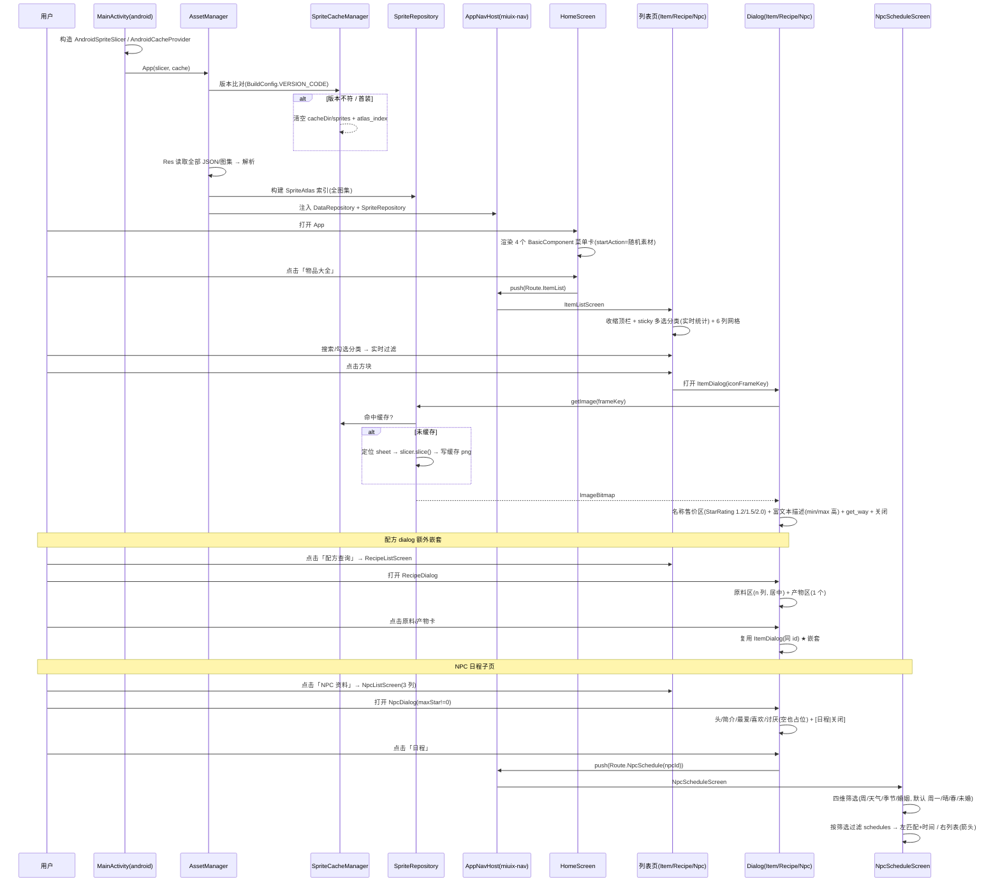
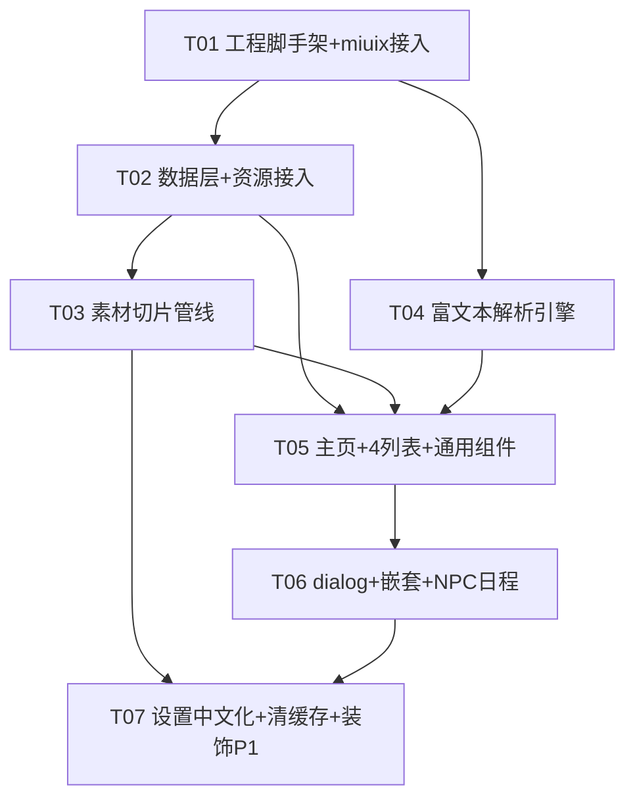

# 奶牛镇百科 App · 系统架构设计文档

> 架构师：高见远（Gao）　|　版本：v1.0　|　日期：2025-08
> 技术基底：Kotlin + Compose Multiplatform（CMP），基于 **miuix** `example/android` demo 副本二次开发
> 目标平台：首版 Android；预留 iOS / 桌面（沿用 CMP 多端能力）

---

## 0. 结论摘要（给主理人 / 转交工程师）

1. **「Basic Component」那两个 title 到底是什么（Q-F 已消除）**

   - demo 中「Basic Component」是一个 `SmallTitle(text = "Basic Component")` **区块标题**，其下方 `Card` 内有 **两个 `BasicComponent` 行**。
   - 用户口中的「两个 title」实际是：① 区块标题 `SmallTitle`（次级标题组件）；② 每个 `BasicComponent` 行的 **`title`（第一行标题）+ `summary`（第二行总结）** 两个文本参数。
   - **要复用的菜单卡片整件 = `BasicComponent`**（来自 `top.yukonga.miuix.kmp.basic.BasicComponent`）。背景色/圆角来自外层 `Card`，内边距来自 `Card`(`horizontal=12dp,bottom=12dp`)+`BasicComponent.insideMargin(=16dp)`，高度下限 `56dp`，左右字号由 `MiuixTheme.textStyles.headline1`(Medium) / `body2` 区分。
   - **改造**：主页 4 卡片 = 4 个 `BasicComponent`，`startAction` 换成显示二级菜单随机素材的正方形 `Image`，`title`=卡片名，`summary`=总结，`onClick`=路由跳转；整体用 `Card` 包裹，卡片间用分区式外边距（非紧贴）。

2. **工程改造方式**

   - 复制 `miuix/example` 为 `:shared`(commonMain 全量 UI/逻辑) + `:app`(android 仅 MainActivity/Manifest) 双模块结构，**保留 CMP 多端骨架**以便后续 iOS/桌面。
   - miuix 作为**外部依赖**通过 **Gradle 复合构建（composite build）** 引入（`settings.gradle.kts` 中 `includeBuild("<miuix 根目录>")`），依赖 `miuix-ui / miuix-nav / miuix-preference / miuix-icons / miuix-blur / miuix-squircle`，无需发布到 Maven。
   - 包名建议：`com.nainiuzhen.wiki`（applicationId / namespace）。

3. **任务列表顺序（按实现先后，详见第 10 节）**

   - T01 工程脚手架 + miuix 接入（包名/主题/入口） →
   - T02 数据层 + 资源接入（JSON→模型，icon_mapping/黑名单） →
   - T03 素材切片管线（plist 解析 + 切片 + 版本化缓存） →
   - T04 富文本解析引擎（颜色/字号/`\n`） →
   - T05 主页 + 4 图鉴列表（4 BasicComponent 卡片、收缩顶栏、sticky 多选分类、6/3 列网格） →
   - T06 物品/配方/NPC dialog + 原料产物嵌套 + NPC 日程子页（路由打通） →
   - T07 设置页中文化 + 清理缓存 + 装饰预览(P1)。

---

## 1. 实现方案与框架选型

| 维度         | 决策                                                                      | 理由                                                                              |
| ------------ | ------------------------------------------------------------------------- | --------------------------------------------------------------------------------- |
| 语言/UI      | **Kotlin + Compose Multiplatform**                                        | 与 miuix 一致；保留 iOS/桌面扩展能力                                              |
| UI 组件库    | **miuix**（`miuix-ui` 等）                                                | PRD 硬性要求严格沿用 miuix 设计语言                                               |
| 改造基底     | 复制 `miuix/example/android` + `miuix/example/shared`                     | 复用 demo 的导航/设置/主题/组件示例                                               |
| 外部依赖接入 | **Gradle composite build**（`includeBuild(miuixRoot)`）                   | miuix 在 git 中被 gitignore，作为外部依赖；复合构建可按坐标自动替换，免发布       |
| 模块划分     | `:shared`(commonMain，全部 UI/数据/切片/富文本) + `:app`(android，仅入口) | 完全对齐 demo 结构，便于多端                                                      |
| 资源读取     | **Compose Resources**（`composeResources/files/`）                        | 跨平台一致；JSON/图集/图均经 `Res.readBytes` 读取，无需 Android `assets` 特殊路径 |
| 图片加载     | 直接 `Image(ImageBitmap)` 渲染切片结果                                    | 素材为本地切片位图，无网络图；不引入 Coil（可选）                                 |
| 序列化       | **kotlinx-serialization-json**                                            | 解析各 config JSON；demo 已依赖                                                   |
| 异步         | **kotlinx-coroutines**                                                    | 资源加载/切片协程化，不阻塞 UI                                                    |

### 1.1 模块结构（对齐 miuix demo）

```
nainiuzhen-baike/                 # 应用工程根（独立于 miuix 仓库）
├── settings.gradle.kts           # includeBuild(miuix) + 本工程模块
├── gradle.properties
├── gradle/libs.versions.toml     # 自有版本目录（AGP/Kotlin/Compose/serialization）
├── build.gradle.kts             # 根（pluginManagement 含 miuix build-plugins）
├── shared/                      # :shared   commonMain（全量逻辑+UI）
└── app/                         # :app      android（仅 MainActivity + Manifest）
```

- `:shared` 同时含 `commonMain` 与 `androidMain`：`androidMain` 提供切片/缓存的 **平台实现类**（实现 commonMain 定义的接口），`commonMain` 持有全部可复用逻辑。
- `:app` 仅 `androidMain`：`MainActivity` 构造 Android 切片器/缓存提供器并注入 `App(...)`。

### 1.2 依赖 miuix 的方式（settings.gradle.kts 要点）

```kotlin
// settings.gradle.kts
pluginManagement {
    includeBuild("D:/1Project/nainiuzhen-wiki/miuix/build-plugins") // miuix 约定插件(miuix 内部用，可选)
}
includeBuild("D:/1Project/nainiuzhen-wiki/miuix")                   // 复合构建：本工程按坐标引用 miuix-*
rootProject.name = "nainiuzhen-baike"
include(":shared")
include(":app")
```

```kotlin
// shared/build.gradle.kts (commonMain dependencies 节选)
dependencies {
    api("top.yukonga.miuix:miuix-ui:<与 miuix 根一致版本>")     // 由 composite build 自动替换，无需发布
    api("top.yukonga.miuix:miuix-preference:...")
    implementation("top.yukonga.miuix:miuix-nav:...")
    implementation("top.yukonga.miuix:miuix-icons:...")
    implementation("top.yukonga.miuix:miuix-blur:...")
    implementation("top.yukonga.miuix:miuix-squircle:...")
    implementation(compose.components.resources)
    implementation(libs.kotlinx.serialization.json)
}
```

> 版本号与 miuix 根 `build.gradle.kts`/`gradle.properties` 中声明的一致即可，复合构建会在解析期把 `top.yukonga.miuix:miuix-*` 替换为本地工程模块。
> 若后续 composite 坐标对齐有障碍，回退方案：把本工程作为 `miuix/example/nainiuzhen` 模块置于 miuix 仓库内，直接用 `projects.miuixUi`（与 demo 完全一致）。

---

## 2. Q-F 定位结论（核心）

### 2.1 demo 源码定位

文件：`miuix/example/shared/src/commonMain/kotlin/component/BasicComponentSection.kt`

```kotlin
fun LazyListScope.basicComponentSection() {
    item(key = "basicComponent") {
        SmallTitle(text = "Basic Component")        // ← 区块标题（次级标题组件）
        Card(Modifier.padding(horizontal=12.dp).padding(bottom=12.dp)) {
            BasicComponent(                          // ← 第 1 个菜单行
                title = "Title", summary = "Summary",
                startAction = { Text("Start") },
                endActions = { Text("End1") /*…*/ },
                enabled = true,
            )
            BasicComponent(                          // ← 第 2 个菜单行（disabled 样式）
                title = "Title", summary = "Summary",
                startAction = { Text("Start", color = disabled) },
                endActions = { /*…*/ }, enabled = false,
            )
        }
    }
}
```

### 2.2 组件名与样式来源（一一对应）

| 用户口中的概念                      | 真实组件 / 参数                      | 来源与默认值                                                                                                                                                                    |
| ----------------------------------- | ------------------------------------ | ------------------------------------------------------------------------------------------------------------------------------------------------------------------------------- |
| 「Basic Component」标题             | `SmallTitle(text="Basic Component")` | `miuix-ui` `SmallTitle.kt`，样式 `MiuixTheme.textStyles.subtitle`，内边距 `PaddingValues(28.dp,8.dp)`                                                                           |
| 两个「title」①                      | `BasicComponent` 的 `title` 参数     | 渲染为 `MiuixTheme.textStyles.headline1` + `FontWeight.Medium`（第一行，主色）                                                                                                  |
| 两个「title」②                      | `BasicComponent` 的 `summary` 参数   | 渲染为 `MiuixTheme.textStyles.body2`（第二行，次要色）                                                                                                                          |
| 菜单卡片整件（含背景/圆角/内边距）  | `Card { BasicComponent(...) }`       | `Card` 提供 surface 背景 + 主题圆角；`Card` 外边距 `horizontal=12dp,bottom=12dp`；`BasicComponent.insideMargin = PaddingValues(16.dp)`（`BasicComponentDefaults.InsideMargin`） |
| 左侧 Start 位（需求改为正方形素材） | `BasicComponent.startAction`         | `@Composable (() -> Unit)?`，放入 `Image` 即可                                                                                                                                  |
| 点击跳转                            | `BasicComponent.onClick`             | 存在即 `clickable`                                                                                                                                                              |

### 2.3 主页 4 卡片改造方案

```kotlin
Card(Modifier.padding(horizontal = 12.dp).padding(bottom = 12.dp)) {  // 分区式外边距（非紧贴）
    MenuEntry(                              // 物品大全
        title = "物品大全", summary = "查询全部物品资料",
        iconFrameKey = randomItemFrameKey(),   // 二级菜单随机素材
        onClick = { navigator.push(Route.ItemList) },
    )
    MenuEntry(                              // 配方查询 / NPC 资料 / 装饰预览 同理
        title = "配方查询", summary = "图纸与菜谱制作指引",
        iconFrameKey = randomRecipeFrameKey(), onClick = { navigator.push(Route.RecipeList) },
    )
    // ……NPC 资料、装饰预览
}

// MenuEntry 内部 = 一个 BasicComponent
BasicComponent(
    title = title, summary = summary,
    startAction = { SpriteImage(frameKey = iconFrameKey, modifier = Modifier.size(56.dp)) }, // 左侧正方形素材
    onClick = onClick,
)
```

> 需求原文「高度为 2 倍中的方形」→ 让 `startAction` 的 `Image` 高度 ≈ `BasicComponent` 行高（默认下限 56dp，可由 `insideMargin`/外层约束放大为方形象素），左图右两行，与 demo Start/Title/Summary 布局一致。

---

## 3. 工程目录树（文件列表 · 相对路径）

> 根：`D:/1Project/nainiuzhen-wiki/nainiuzhen-baike/`
> 资源统一放在 `shared/src/commonMain/composeResources/files/`（由 `assets/` 复制/同步），按 `Res.readBytes("files/<path>")` 读取。

```
nainiuzhen-baike/
├── settings.gradle.kts
├── gradle.properties
├── gradle/
│   └── libs.versions.toml
├── build.gradle.kts
├── README.md
├── tools/build.ps1                         (沿用，无需改动)
├── builds/                                (沿用)
├── shared/
│   ├── build.gradle.kts
│   └── src/
│       ├── commonMain/
│       │   ├── kotlin/com/nainiuzhen/wiki/
│       │   │   ├── App.kt                       # 应用入口（接收切片器/缓存器）
│       │   │   ├── data/
│       │   │   │   ├── model/
│       │   │   │   │   ├── ItemInfo.kt          # 物品模型
│       │   │   │   │   ├── RecipeInfo.kt        # 配方模型（+RecipeMaterial）
│       │   │   │   │   ├── NpcInfo.kt           # NPC 模型
│       │   │   │   │   ├── NpcSchedule.kt       # 日程 + ScenePoint
│       │   │   │   │   ├── SpriteAtlas.kt       # 图集索引 + SpriteAtlasFrame
│       │   │   │   │   └── RichText.kt          # 富文本节点（sealed）
│       │   │   │   ├── source/
│       │   │   │   │   ├── AssetLoader.kt       # Res 读取 JSON/图（commonMain）
│       │   │   │   │   ├── SpriteSlicer.kt      # interface（commonMain 定义）
│       │   │   │   │   └── CacheProvider.kt     # interface（提供 cacheDir）
│       │   │   │   ├── repository/
│       │   │   │   │   ├── DataRepository.kt    # 聚合 Item/Recipe/Npc 仓储
│       │   │   │   │   ├── SpriteRepository.kt  # 图集索引 + 取图（懒切片+缓存）
│       │   │   │   │   └── SpriteCacheManager.kt# 版本比对 + 手动清理
│       │   │   │   └── AssetManager.kt          # 启动加载全部资源 → 仓储
│       │   │   ├── sprite/
│       │   │   │   └── PlistParser.kt           # 解析 Cocos2d plist → SpriteAtlasFrame
│       │   │   ├── richtext/
│       │   │   │   └── RichTextParser.kt        # /#颜色#内容/# 解析
│       │   │   ├── ui/
│       │   │   │   ├── theme/Theme.kt           # MiuixTheme 封装（沿用 miuix 主题）
│       │   │   │   ├── nav/Route.kt             # @Serializable sealed Route（miuix-nav）
│       │   │   │   ├── nav/AppNavHost.kt        # NavDisplay 路由表
│       │   │   │   ├── home/HomeScreen.kt       # 主页 4 卡片
│       │   │   │   ├── components/
│       │   │   │   │   ├── MenuCard.kt          # 基于 BasicComponent 的菜单卡片
│       │   │   │   │   ├── CollapsibleTopBar.kt # 收缩顶栏 + SearchBar
│       │   │   │   │   ├── CategoryChipBar.kt   # sticky 多选分类 + 实时统计
│       │   │   │   │   ├── SpriteImage.kt       # 切片图显示（ImageBitmap）
│       │   │   │   │   ├── ItemCard.kt          # 6 列方块 + 11sp 名称滚动
│       │   │   │   │   ├── StarRating.kt        # 白/金/紫星卡（1.2/1.5/2.0）
│       │   │   │   │   └── MaterialCard.kt      # 原料/产物卡（复用 ItemCard 样式）
│       │   │   │   ├── items/ItemListScreen.kt
│       │   │   │   ├── items/ItemDialog.kt
│       │   │   │   ├── recipe/RecipeListScreen.kt
│       │   │   │   ├── recipe/RecipeDialog.kt
│       │   │   │   ├── npc/NpcListScreen.kt
│       │   │   │   ├── npc/NpcDialog.kt
│       │   │   │   ├── npc/NpcScheduleScreen.kt # 全页：筛选 + 日程
│       │   │   │   ├── decoration/DecorationScreen.kt  # P1
│       │   │   │   └── settings/SettingsScreen.kt      # 中文化 + 清理缓存
│       │   │   └── utils/AppState.kt            # 全局状态（搜索/筛选/设置）
│       │   └── composeResources/files/          # ← 由 assets/ 同步而来
│       │       ├── item_database.json
│       │       ├── npc_database.json
│       │       ├── compound_unlocks.json
│       │       ├── npc_ai_database.json
│       │       ├── icon_mapping.json
│       │       ├── item_blacklist.txt
│       │       ├── npc_blacklist.txt
│       │       ├── items.png  items1.png … items22.png   (+ 同名 .plist)
│       │       ├── equip.png (+equip.plist)
│       │       ├── headwear.png (+headwear.plist)
│       │       ├── npcs/1.png … 57 个                       # NPC 立绘，无需切片
│       │       └── star/lv_2.png lv_3.png lv_4.png          # 白/金/紫星
│       └── androidMain/kotlin/com/nainiuzhen/wiki/
│           └── platform/
│               ├── AndroidSpriteSlicer.kt       # SpriteSlicer 实现（Bitmap 裁剪/旋转）
│               └── AndroidCacheProvider.kt      # CacheProvider 实现（context.cacheDir）
└── app/
    ├── build.gradle.kts
    └── src/main/
        ├── AndroidManifest.xml
        └── kotlin/com/nainiuzhen/wiki/MainActivity.kt  # 构造切片器/缓存器 → App()
```

---

## 4. 数据结构与接口

### 4.1 类图（Mermaid classDiagram）

```mermaid
classDiagram
    %% ===== 数据模型 =====
    class ItemInfo {
        +Int id
        +String name
        +String descRaw
        +String source
        +Int? iconHint
        +Int type
        +Int? price
        +Int? sellboxPrice
        +String iconFrameKey
        +ItemGroup group
    }
    class RecipeInfo {
        +Int id
        +String name
        +Int type
        +String typeLabel
        +String category
        +Int target
        +Int targetNum
        +List~RecipeMaterial~ materials
        +Int iconHint
        +String? deblockingDesc
        +String? descRaw
        +Int? price
    }
    class RecipeMaterial {
        +Int id
        +Int num
    }
    class NpcInfo {
        +Int id
        +String name
        +String descRaw
        +String address
        +String birthday
        +Int sex
        +Int loveItemId
        +Int maxStar
        +List~Int~ likeItems
        +List~Int~ hateItems
        +List~Int~ bestFavorItems
    }
    class NpcSchedule {
        +Long id
        +Int npcId
        +String name
        +Int startTime
        +String startTimeText
        +ScenePoint startPoint
        +ScenePoint endPoint
        +List~Int~ week
        +List~Int~ season
        +List~Int~ weather
        +Int isAstar
        +List~Int~ relation
    }
    class ScenePoint {
        +Int sceneId
        +Int row
        +Int col
        +String sceneName
    }
    class SpriteAtlasFrame {
        +String sheetName
        +Rect rect
        +Boolean rotated
        +Point offset
        +Size sourceSize
    }
    class SpriteAtlas {
        -Map~String, SpriteAtlasFrame~ frames
        +getFrame(name) SpriteAtlasFrame?
        +sheetNames() List~String~
    }
    class RichSpan
    class TextSpan {
        +String text
        +Color? color
        +Float? fontSizeSp
    }
    class NewlineSpan
    RichSpan <|-- TextSpan
    RichSpan <|-- NewlineSpan

    %% ===== 服务/仓储 =====
    class AssetLoader {
        +loadJson(name) String
        +loadBytes(path) ByteArray
    }
    class PlistParser {
        +parse(plistBytes) List~SpriteAtlasFrame~
    }
    class SpriteSlicer {
        <<interface>>
        +slice(sheetBytes, frame) ImageBitmap
    }
    class CacheProvider {
        <<interface>>
        +String cacheDir
    }
    class SpriteCacheManager {
        -String cacheDir
        -Int currentVersion
        +needsRebuild() Boolean
        +markBuilt()
        +clear()
        +spriteFile(frameKey) File
        +atlasIndexFile() File
    }
    class SpriteRepository {
        -SpriteAtlas atlas
        -SpriteSlicer slicer
        -SpriteCacheManager cache
        +getImage(frameKey) ImageBitmap
        +getNpcImage(npcId) ImageBitmap
        +getStarImage(level) ImageBitmap
    }
    class DataRepository {
        -List~ItemInfo~ items
        -List~RecipeInfo~ recipes
        -List~NpcInfo~ npcs
        -Map~Int,List~NpcSchedule~~ schedules
        +itemsByType(types) List~ItemInfo~
        +recipeById(id) RecipeInfo?
        +itemById(id) ItemInfo?
        +npcById(id) NpcInfo?
        +npcSchedules(npcId) List~NpcSchedule~
    }
    class RichTextParser {
        +parse(raw) List~RichSpan~
    }
    class AssetManager {
        +loadAll() DataRepository
    }

    %% ===== 关系 =====
    RecipeInfo "1" *-- "0..*" RecipeMaterial : materials
    NpcSchedule "1" *-- "2" ScenePoint : start/end
    SpriteAtlas "1" *-- "0..*" SpriteAtlasFrame : frames
    SpriteRepository --> SpriteAtlas : 查询
    SpriteRepository --> SpriteSlicer : 切片
    SpriteRepository --> SpriteCacheManager : 缓存读写
    DataRepository --> ItemInfo
    DataRepository --> RecipeInfo
    DataRepository --> NpcInfo
    DataRepository --> NpcSchedule
    AssetManager --> AssetLoader
    AssetManager --> PlistParser
    AssetManager --> DataRepository : 构建
    AssetManager --> SpriteRepository : 构建
    RichTextParser ..> RichSpan : 产出
    AndroidSpriteSlicer ..|> SpriteSlicer
    AndroidCacheProvider ..|> CacheProvider
```



### 4.2 关键模型字段（来自 assets 实测）

**ItemInfo** ← `item_database.json`（键=id 字符串）

| 字段                  | 类型    | 说明                                    |
| --------------------- | ------- | --------------------------------------- |
| id                    | Int     | 物品 id                                 |
| name                  | String  | 名称                                    |
| desc                  | String  | 富文本原始串（`/#颜色#内容/#`、`\n`）   |
| source                | String? | 来源 `get_way`                          |
| icon                  | Int?    | 切片 key 提示（与 icon_mapping 二选一） |
| type                  | Int     | 分类类型（鱼类/矿石/加工品…）           |
| price / sellbox_price | Int?    | 售价（无则隐藏价格区）                  |

> `iconFrameKey = icon_mapping[id] ?: item.icon ?: id` → 帧名 `"$iconFrameKey.png"`，在 items/equip/headwear 图集中查找。

**RecipeInfo** ← `compound_unlocks.json`（`items[]`）

| 字段                                | 类型         | 说明                   |
| ----------------------------------- | ------------ | ---------------------- |
| id, name, type, typeLabel, category | —            | 配方标识               |
| target / targetNum                  | Int          | 产物物品 id / 数量     |
| materials                           | List{id,num} | **原料区**             |
| deblockingDesc                      | String?      | **解锁条件 / get_way** |
| icon                                | Int          | 切片 key               |
| desc                                | String?      | 富文本描述             |

**NpcInfo** ← `npc_database.json`

| 字段                                   | 类型      | 说明                                                    |
| -------------------------------------- | --------- | ------------------------------------------------------- |
| id, name, desc, address, birthday, sex | —         | 基础信息                                                |
| loveItemId                             | Int       | 这个是对应NPC好感度，这个东西的物品id，不是喜欢的物品id |
| maxStar                                | Int       | **好感 max：x 心**（=0 时日程按钮禁用）                 |
| bestFavorItems / likeItems / hateItems | List<Int> | **最爱 / 喜欢 / 讨厌**（空仍占位）                      |

**NpcSchedule** ← `npc_ai_database.json`（`schedules[]`）

| 字段                                      | 类型         | 说明                                       |
| ----------------------------------------- | ------------ | ------------------------------------------ |
| name                                      | String       | 日程名（大字）                             |
| startTime / startTimeText                 | Int / String | 开始时间（分钟，360→06:00）                |
| startPoint / endPoint                     | ScenePoint   | 路线起止场景（小字 `sceneName`，箭头连接） |
| week[1..7] / season[1..4] / weather[1..5] | List<Int>    | **筛选维度**                               |
| isAstar                                   | Int          | 0=未婚 / 1=已婚（需求指定据此过滤婚姻）    |
| relation                                  | List<Int>    | 婚姻关联字段（见待明确 Q-婚姻）            |

**SpriteAtlasFrame**（由 plist 解析）
`frame={{x,y},{w,h}}`、`rotated`、`sourceSize`、`offset` → 裁剪矩形 + 旋转 + 居中偏移。

---

## 5. 程序调用流程（时序图）



---

## 6. 四个开放问题（PRD 第 6 节）落地说明

| 问题                               | 结论                                                                                               | 架构落地方式                                                                                                                                                                              |
| ---------------------------------- | -------------------------------------------------------------------------------------------------- | ----------------------------------------------------------------------------------------------------------------------------------------------------------------------------------------- |
| **Q1 分类多选 vs 单选 / 统计位置** | 多选 chip + 默认全选 + 统计「共 N 个」置于 search 下方 sticky 栏右侧，实时刷新                     | `CategoryChipBar`（sticky，不随顶栏收缩消失）持有 `Set<Int> selectedTypes`；统计由 `DataRepository.itemsByType(selected)` 大小实时计算；与 `CollapsibleTopBar` 的搜索框同处一屏、互不遮挡 |
| **Q2 翻页 vs 滚动**                | 首版**滚动**；翻页列入 P2                                                                          | 列表用 `LazyVerticalGrid`（6 列）/ `LazyRow`（NPC 3 列）；`CollapsibleTopBar` 收缩时搜索框收窄但 sticky 分类栏保留统计，解决「顶栏收缩无空间」痛点                                        |
| **Q3 切片缓存 + 清缓存策略**       | 缓存至 `cacheDir`；按**版本号**比对，更新自动清除重切；设置页加「清理缓存」手动按钮                | `SpriteCacheManager`：存 `version.txt`，启动比对 `BuildConfig.VERSION_CODE`；不符→删 `sprites/`+`atlas_index.json` 重切；`clear()` 供设置页调用（建议同时显示缓存大小，见 Q-D）           |
| **Q4 dialog 描述区平均高度**       | `min-height`=全量平均行高，`max-height`=上限(≈8 行)，超出滚动；非描述区块结构固定→整体大小相对一致 | `ItemDialog/RecipeDialog/NpcDialog` 的描述区 `Modifier.heightIn(min=avgLines*lineHeight, max=8*lineHeight).verticalScroll`；其余区块固定高度，空列表也占位（NPC 最爱/喜欢/讨厌）          |

---

## 7. 依赖包列表

| 类别      | 包 / 模块                                                                                                   | 版本策略           | 用途                                                                                                |
| --------- | ----------------------------------------------------------------------------------------------------------- | ------------------ | --------------------------------------------------------------------------------------------------- |
| UI 框架   | `top.yukonga.miuix:miuix-ui`                                                                                | composite build    | 基础组件（含 `BasicComponent`/`SmallTitle`/`Card`/`OverlayDialog`/`AdaptiveTopAppBar`/`SearchBar`） |
| 导航      | `top.yukonga.miuix:miuix-nav`                                                                               | composite build    | `NavDisplay`/`NavBackStack`/`Route` 路由                                                            |
| 设置      | `top.yukonga.miuix:miuix-preference`                                                                        | composite build    | `SwitchPreference`/`ArrowPreference`/`OverlayDropdownPreference`                                    |
| 图标      | `top.yukonga.miuix:miuix-icons`                                                                             | composite build    | 返回/搜索/设置等图标                                                                                |
| 模糊/圆角 | `top.yukonga.miuix:miuix-blur` `miuix-squircle`                                                             | composite build    | 顶栏模糊、squircle 圆角（沿用 demo）                                                                |
| CMP 资源  | `org.jetbrains.compose.components:resources`                                                                | 随 Compose         | `Res.readBytes` 读 JSON/图                                                                          |
| 序列化    | `org.jetbrains.kotlinx:kotlinx-serialization-json`                                                          | 随 Kotlin          | 解析 config JSON                                                                                    |
| 协程      | `org.jetbrains.kotlinx:kotlinx-coroutines-*`                                                                | 随 Kotlin          | 异步加载/切片                                                                                       |
| Android   | `androidx.activity` `androidx.profileinstaller`                                                             | AGP 配套           | Activity / Baseline Profile（沿用 demo）                                                            |
| 构建      | `com.android.application` `org.jetbrains.kotlin.plugin.compose` `org.jetbrains.kotlin.plugin.serialization` | libs.versions.toml | Gradle 插件                                                                                         |
| 图片加载  | （可选）`io.coil-kt:coil-compose`                                                                           | 按需               | 网络/占位图；本地切片用 `Image(ImageBitmap)` 即可，**默认不引入**                                   |

> 工具链已在 `D:/Android` 解压（SDK r35/36/37、JDK17、Gradle 8.9、NDK29），构建脚本经 `ANDROID_HOME`/`JAVA_HOME` 引用，无需改动。

---

## 8. 共享知识（跨文件约定）

- **包结构**：根包 `com.nainiuzhen.wiki`；子包 `data.model / data.source / data.repository / sprite / richtext / ui.* / utils`。
- **命名**：数据类 `XxxInfo`；仓储 `XxxRepository`；列表页 `XxxListScreen`；弹窗 `XxxDialog`；组件 `XxxCard/XxxBar`。
- **资源目录**：所有素材经 `shared/src/commonMain/composeResources/files/` 读取，路径前缀 `files/`；图集帧名统一 `<id>.png`。
- **切片缓存 key 规则**：
  - 缓存根：`{cacheDir}/nainiuzhen/`
  - 切片图：`{cacheDir}/nainiuzhen/sprites/{sheetName}/{frameKey}.png`
  - 图集索引：`{cacheDir}/nainiuzhen/atlas_index.json`（避免每次重解析 plist）
  - 版本标记：`{cacheDir}/nainiuzhen/version.txt`（存 `BuildConfig.VERSION_CODE`）
- **NPC 立绘**：`files/npcs/<npcId>.png`（无需切片，直接 `Res` 读为 `ImageBitmap`）。
- **星级图**：`files/star/lv_2.png`(白 1.2) / `lv_3.png`(金 1.5) / `lv_4.png`(紫 2.0)（映射为架构假设，见待明确）。
- **富文本标记语法**（解析自 `desc` 字段）：
  - 单色：`/#RRGGBB#内容/#` → 例 `/#2d7d78#类型：特殊/#`
  - 色+字号：`/#RRGGBB#SIZE#内容/#` → 例 `/#40210d#12#文本/#`（`SIZE` 为 sp 数值）
  - 换行：`\n`（原始串中为 `\\n`）
  - 规则：标记**隐藏**，内容按颜色/字号渲染；未知颜色降级为默认文本色，未知字号降级为 `body2`。
- **路由**：所有页面用 `@Serializable sealed interface Route`（miuix-nav），`Navigator.push/pop`。
- **黑名单**：`item_blacklist.txt` / `npc_blacklist.txt` 为 id 列表；`BuildConfig.DEBUG` 为真时展示、为假（release）时过滤（见待明确 Q-G）。
- **主题**：统一经 `ui/theme/Theme.kt` 封装 `MiuixTheme`（沿用 miuix 配色/字体，确保严格符合 miuix 设计语言）。

---

## 9. 任务依赖图



---

## 10. 有序任务列表（按实现顺序 · 含依赖 · 对应 P0/P1）

| Task    | 名称                                               | 源文件（关键）                                                                                                                                                                                                                           | 依赖        | 优先级 |
| ------- | -------------------------------------------------- | ---------------------------------------------------------------------------------------------------------------------------------------------------------------------------------------------------------------------------------------- | ----------- | ------ |
| **T01** | 工程脚手架 + miuix 接入                            | `settings.gradle.kts`, `build.gradle.kts`, `gradle/libs.versions.toml`, `app/.../MainActivity.kt`, `app/.../AndroidManifest.xml`, `shared/.../App.kt`, `ui/theme/Theme.kt`                                                               | —           | P0     |
| **T02** | 数据层 + 资源接入                                  | `data/model/*`, `data/source/AssetLoader.kt`, `data/repository/DataRepository.kt`, `data/AssetManager.kt`, `composeResources/files/*`(复制 assets)                                                                                       | T01         | P0     |
| **T03** | 素材切片管线                                       | `sprite/PlistParser.kt`, `data/source/SpriteSlicer.kt`(接口)+`platform/AndroidSpriteSlicer.kt`, `data/repository/SpriteCacheManager.kt`, `SpriteRepository.kt`, `ui/components/SpriteImage.kt`, `platform/AndroidCacheProvider.kt`       | T02         | P0     |
| **T04** | 富文本解析引擎                                     | `data/model/RichText.kt`, `richtext/RichTextParser.kt`, `ui/components/RichText.kt`(渲染)                                                                                                                                                | T01         | P0     |
| **T05** | 主页 + 4 图鉴列表 + 通用组件                       | `ui/home/HomeScreen.kt`, `ui/components/MenuCard.kt`, `CollapsibleTopBar.kt`, `CategoryChipBar.kt`, `ItemCard.kt`, `StarRating.kt`, `items/ItemListScreen.kt`, `recipe/RecipeListScreen.kt`, `npc/NpcListScreen.kt`, `utils/AppState.kt` | T02,T03,T04 | P0     |
| **T06** | 物品/配方/NPC dialog + 原料产物嵌套 + NPC 日程子页 | `ui/nav/Route.kt`, `AppNavHost.kt`, `items/ItemDialog.kt`, `recipe/RecipeDialog.kt` + `MaterialCard.kt`, `npc/NpcDialog.kt`, `npc/NpcScheduleScreen.kt`                                                                                  | T05         | P0     |
| **T07** | 设置页中文化 + 清理缓存 + 装饰预览(P1)             | `ui/settings/SettingsScreen.kt`, `ui/decoration/DecorationScreen.kt`                                                                                                                                                                     | T03,T06     | P1     |

> 说明：T01–T06 覆盖 PRD 全部 P0-1~P0-11；T07 覆盖 P1-1/P1-4 与装饰预览框架。P1-2(equip/headwear/element 分离)、P1-3(工坊合集)、P1-5(富文本完善)、P1-6(搜索实时过滤) 分别在 T02/T05 内以「数据 group 字段 + 独立入口/筛选」方式预留，不单列任务以免拆解过碎。

---

## 11. 待明确事项（Q-A ~ Q-G 架构层面建议 / 默认值）

| #              | 问题                                     | 架构建议 / 默认值                                                                                                                                                                                             |
| -------------- | ---------------------------------------- | ------------------------------------------------------------------------------------------------------------------------------------------------------------------------------------------------------------- |
| **Q-A**        | 装饰预览数据/素材是否齐备                | P1。当前 `assets` 未见庄园布局/季节/动态素材。架构已预留 `DecorationScreen` + `ItemGroup.Element` 入口；**首版用占位/空状态**，待素材补齐再接数据，不影响 P0。                                                |
| **Q-B**        | equip/headwear/element 分离口径          | `ItemInfo.group: ItemGroup` 枚举 = `Items/Equip/Headwear/Element/Recipe`；以 `item.type` 或 `icon` 归属判定（equip/headwear 本就有独立图集）。列表可按 group 过滤或设独立入口（P1-2）。                       |
| **Q-C**        | 富文本颜色码/字号枚举                    | 颜色=任意 6 位 hex（`/#RRGGBB#`），字号=sp 数值（`/#RRGGBB#12#`），解析器对未知值降级默认；换行=`\n`。无需枚举白名单，保证渲染不崩。                                                                          |
| **Q-D**        | 清理缓存是否显示大小                     | 建议**显示**（P1-4）。`SpriteCacheManager.cacheSize()` 计算 `sprites/` 字节数，设置页文案「清理缓存（xx MB）」。                                                                                              |
| **Q-E**        | 顶栏分类 icon 弹层 vs sticky 栏是否并存  | **并存**。`CategoryChipBar`(sticky) 为主筛选（多选+统计）；顶栏右 icon 用 miuix `OverlayIconDropdownMenu` 作快捷跳转/筛选；两者共享 `AppState.selectedTypes`。                                                |
| **Q-F**        | 「Basic Component」两 title 组件名       | **已定位并消除**（见第 2 节）：`SmallTitle` + `BasicComponent(title/summary)`；菜单卡片 = `Card{BasicComponent(startAction=Image)}`。                                                                         |
| **Q-G**        | debug/release 黑名单开关                 | 首版默认：**release 过滤黑名单，debug 展示**（`BuildConfig.DEBUG` 控制 `DataRepository` 构建时的过滤）。构建配置无需改。                                                                                      |
| **Q-婚姻**     | 日程婚姻过滤用 `isAstar` 还是 `relation` | 需求原文指定用 `isAstar`(0未婚/1已婚)。`relation` 字段亦存在（值如 1,2,3,6 / 4,5），建议**以 `isAstar` 为准**实现婚姻筛选；若实测发现 `relation` 才是权威字段，再切换（架构已同时建模两字段，切换成本极低）。 |
| **Q-星图映射** | `star/lv_2                               | 3                                                                                                                                                                                                             |

---

## 12. 风险与备注

- **miuix 版本对齐**：composite build 依赖 miuix 模块坐标与版本；若本地 miuix 未声明可发布版本，回退为「模块置于 miuix 仓库内」方案（见 1.2）。
- **图集较大**：23 张 items 图集 + plist，首装解析/索引构建一次性完成并缓存 `atlas_index.json`；逐帧**懒切片 + 缓存**，启动不卡。
- **dexopt**：`assets/dexopt/*.prof|*.profm` 为 Android ART Baseline Profile，与本项目无关，无需处理。
- **严格 miuix 风格**：所有自定义组件（菜单卡/顶栏/分类栏/dialog）均基于 miuix 原生组件二次封装，不引入第三方 UI 库，确保设计语言一致。

---

## 13. 附录：版本演进与当前实现状态（v1.0.10 / build-10）

> 本文档为立项初期（v1.0，2025-08）的规划；以下记录相对原方案的实际落地偏差与 v8/v9 关键修复，便于后续接手工程师对齐最新状态。版本号约定：`vN ↔ 1.0.N ↔ build-N`，当前最新 **v1.0.10 / build-10**（常量 `APP_VERSION_NAME` 位于 `utils/AppState.kt`）。

### 13.1 与原方案的关键偏差（已实现，覆盖原描述）
1. **资源读取：从 `composeResources/files/` 改为 Android 原生 `assets/`**（build #2 修复）。
   - 原方案：CMP `Res.readBytes("files/...")`。实测 `:shared` 经 composeResources 的资源**不会合并进纯 Android 的 `:app` 消费者** → 真机 `MissingResourceException` 闪退（APK 内 `composeResources` 条目数为 0）。
   - 现状：`AssetLoader` 经 `expect fun readAssetBytes(path)`，Android 侧 `PlatformAssetReader` 用 `AssetManager.open(path)` 读取；121 个文件复制到 `app/src/main/assets/`。（`composeResources/files/` 为冗余死数据。）
2. **切片加载改为异步（启动变慢排查 #1）**。
   - 旧实现：`SpriteImage` 在 `remember` 中**同步**调用 `sprite.getImage()`，切片/解码在主线程；版本号变更触发全量重切时首屏严重卡顿。
   - 现状：`SpriteImage` / `NpcPortraitImage` / `StarImage` 均用 `produceState` + `withContext(Dispatchers.IO)` 异步取图，先占位后替换，主线程不再被切片阻塞。（同一 sheet 的逐帧重复解码仍为次要性能项，未做 sheet 级缓存以避免 OOM。）
3. **底栏方案（悬浮模式）**：`floatingNavigationBarStyle` 0=Miuix / 1=iOS。
   - iOS 风格移植自 miuix demo 的 `LiquidGlassNavigationBar`（液态玻璃：折射 / 高光 / 按住拖动切换 / 选中果冻弹跳 / 多一圈层级），位于 `ui/components/liquid/`（5 个文件：DampedDragAnimation / InteractiveHighlight / CombinedBackdrop / InnerShadow / IosLiquidGlassNavigationBar，package 改为 `com.nainiuzhen.wiki.ui.components.liquid`，仅把 demo 的 `ui.isInDarkTheme()` 替换为 Compose `isSystemInDarkTheme()`）。
   - Miuix 风格悬浮底栏改为 `surface` 基色 + 0.9 模糊不透明度，修正浅色主题偏黑「污渍」观感。
   - 角标默认关闭（`showNavigationBadge=false`）；启用时为红色（`MiuixTheme.colorScheme.error`）并置于 icon 右上角外侧不遮挡。
4. **富文本解析修正（build #9）**：繁荣度等「不带字号」格式 `/#颜色#内容/#` 此前被误判为字号，已修复 `RichTextParser` 区分「有/无字号」两种形态。语法：`/#RRGGBB#内容/#`（无字号）与 `/#RRGGBB#SIZE#内容/#`（SIZE=sp）。
5. **关于页闪退修复（build #10）**：`AboutScreen` 外层 `Box` 已 `layerBackdrop`，内层 `BgEffectBackground` 又传 `layerBackdrop` 导致同一 backdrop 重入录制异常；已去除内层嵌套的 `layerBackdrop`，仅保留外层。
6. **NPC dialog**：顶栏立绘放大至 120%（144.dp）；好感 max 改为 `[★] N 心 [★]`（max 图标 = `MiuixIcons.FavoritesFill`）；最爱/喜欢/讨厌分区标题加同色下划线；弹窗内距最小化。按钮已对称（`fillMaxWidth(0.49f)`）。
7. **日程筛选区模糊同步顶栏**（build #10）：筛选区由纯 `surface` 改为采样同一 backdrop 的 `textureBlur` 处理，与顶栏模糊一致。
8. **物品/配方计数左对齐**：计数文本 `TextAlign.Start` 并与搜索框/网格同 12.dp 左对齐；收起（无搜索词）时不留额外间距。

### 13.2 工程 / 工具链现状（与原 §7 / §12 偏差）
- **Gradle**：AGP 9.3.2 要求 **Gradle ≥ 9.5**，工程使用 **Gradle 9.6.1**（原文档写的 8.9 已不可用，会报 `Minimum supported Gradle version is 9.5.0`）。miuix 复合构建根：`D:/1Project/nainiuzhen-wiki/miuix`（`settings.gradle.kts` 中 `includeBuild`）。
- **缓存版本标记**：存 `version.txt`（整数版本号，由 `AndroidSpriteCacheManager.currentVersion()` 提供），**非** `BuildConfig.VERSION_CODE`。版本不符 → 删 `sprites/` 重切。
- **出包**：`tools/build.ps1` 递增 `builds/build_number.txt` → 双包（release+debug）→ git commit + `build-N` tag。
- **启动流程**：`App.kt` 的 `AppRoot` 在 `LaunchedEffect` 中以 `Dispatchers.IO` 执行 `AssetManager.loadAll`；进程存活时复用 `cachedLoadedData`，避免后台回前台重加载。

### 13.3 待确认 / 已知坑
- 关于页闪退修复已靠代码审查定位，需真机验证（必要时抓 logcat）。
- 日程筛选「从婚姻筛选下开始」的渐进模糊细节需结合真机截图最终确认。
- 文件命名已演进：`ItemListScreen`/`RecipeListScreen`/`NpcListScreen`/`NpcDetailScreen`/`NpcScheduleScreen`/`AppSubPageScaffold`/`AboutScreen` 等，与本文档第 3 节规划名（`ItemDialog`/`RecipeDialog`/`CollapsibleTopBar`/`CategoryChipBar` 等）不完全一致，以工程实际文件为准。

